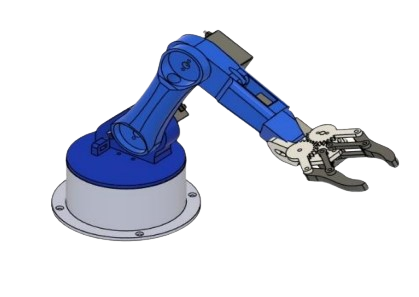
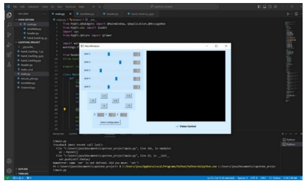
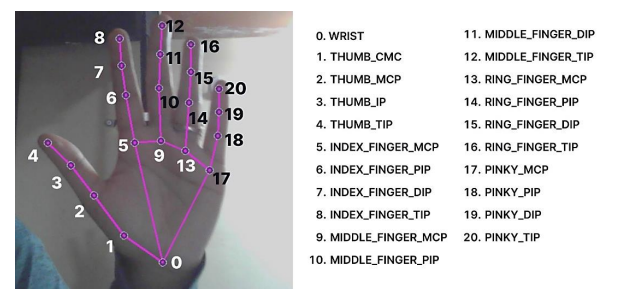
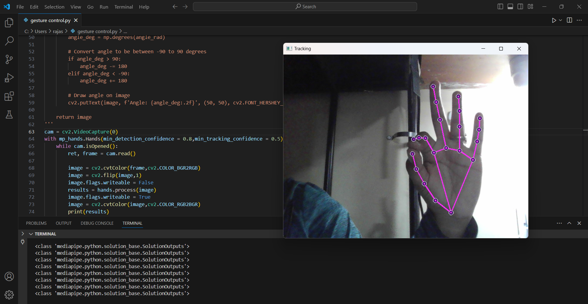

# AI-Based Approach in Teleoperation of Robotic Arms
 ## Project Overview💻
This project implements a **vision-based AI solution** for teleoperating robotic arms, allowing users to control a robotic arm in real-time through hand gestures. By utilizing **MediaPipe** and **OpenCV**, hand tracking and gesture recognition enable the robotic arm to mimic human movements with precision.


## Key Features🔑
- **Real-Time Hand Gesture Control**: The system interprets hand movements captured by a webcam and maps them to robotic arm motions.
- **MediaPipe Integration**: Robust hand tracking and gesture recognition using MediaPipe for accurate control.
- **Kinematics Processing**: Forward and inverse kinematics are employed to ensure precise movement mapping.
- **Affordable and Efficient**: The system provides an accessible, low-cost solution for AI-driven robotic control.

### Methodology
1. **Hand Pose Tracking**: The system uses a standard webcam and MediaPipe for real-time hand tracking.
2. **Kinematics Calculation**: Hand gestures are converted into movement commands for the robotic arm using kinematics algorithms.
3. **Control Signal Generation**: Control signals are generated to drive the robotic arm's servos, translating hand gestures into robotic actions.

## Components
- **Hardware**: 
  - 3D-printed 5-axis robotic arm
  - Arduino Uno for control
  - Servo motors: 3 x MG996R and 2 x SG90
- **Software**:
  - **Python** for control logic
  - **OpenCV** for image processing
  - **MediaPipe** for hand gesture recognition
  - **PyQt** for the user interface
- **User Interface**: Provides visual feedback for hand movements and control options for robotic arm manipulation.
 <p> &ensp;&ensp;  </p>

## Results 
### Demonstration

 

### Landmarks




<p></p>

## Getting Started

### Prerequisites
Ensure you have the following installed:
- Python 3.7 to 3.10
- OpenCV (`pip install opencv-python`)
- MediaPipe (`pip install mediapipe`)
- PyQt5 (`pip install PyQt5`)
- Arduino IDE (for uploading code to the Arduino)

### Installation
1. Clone the repository:
   ```bash
   https://github.com/Rajasreesingamshetty5geetha/AI-Based-Approach-in-Teleoperation-of-Robotic-Arms.git
   
